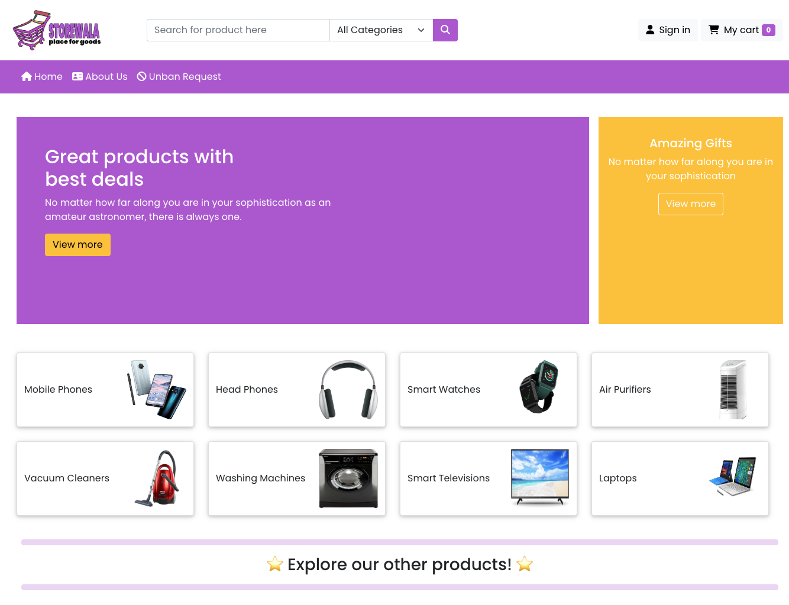
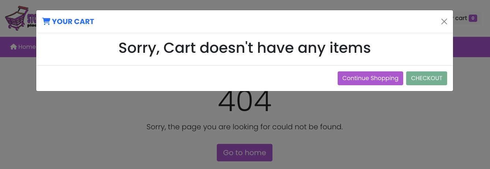
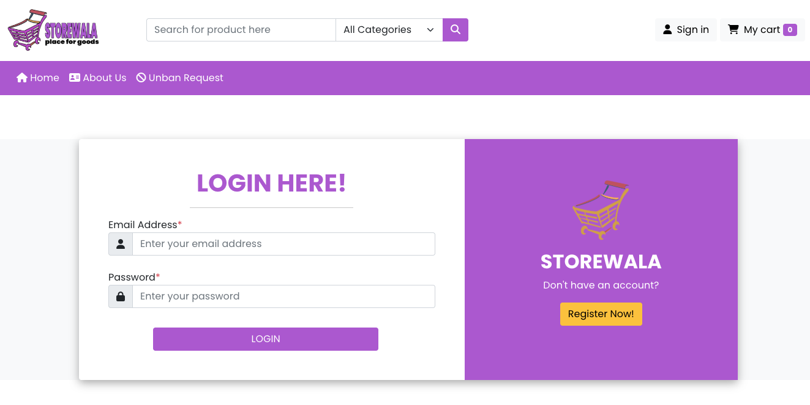
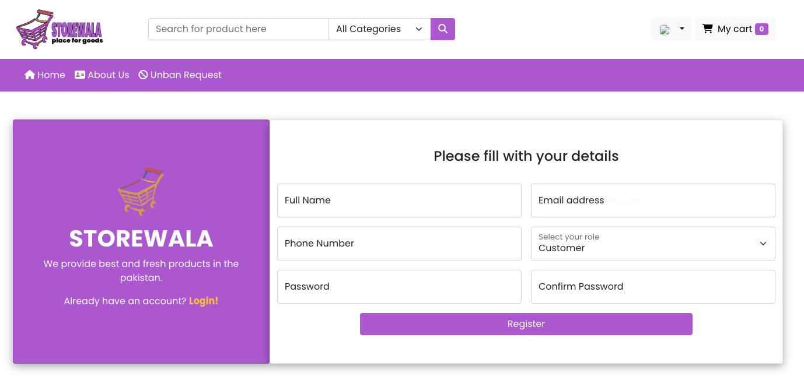
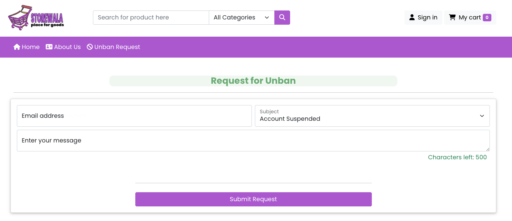

# E-Commerce Application 4 🛒

A comprehensive e-commerce web application built with Spring Boot 3, featuring multi-role user management, product
catalog, order processing, and administrative controls.

## 🌟 Features

### 🏠 Core Functionality

- **Multi-Role Authentication**: Support for Customers, Sellers, and Administrators
- **Product Management**: Complete CRUD operations for products with image uploads
- **Category Management**: Organize products into categories
- **Order Processing**: Full order lifecycle management
- **User Profiles**: Comprehensive user management with profile customization
- **Search & Filter**: Advanced product search and filtering capabilities

### 👨‍💼 Admin Features

- **User Management**: Suspend/unsuspend users, delete accounts
- **Category Management**: Create and manage product categories
- **System Monitoring**: Overview of platform activities
- **Ban Management**: Handle user suspension requests

### 🛍️ Seller Features

- **Product Listing**: Add, edit, and manage product inventory
- **Image Upload**: Support for multiple product images
- **Sales Dashboard**: Track product performance
- **Inventory Management**: Monitor stock levels

### 🛒 Customer Features

- **Product Browsing**: Browse and search products
- **Shopping Cart**: Add products to cart and checkout
- **Order Tracking**: View order history and status
- **Product Reviews**: Comment and review products
- **Profile Management**: Update personal information

## 🏗️ Technology Stack

### Backend

- **Framework**: Spring Boot 3.5.5
- **Java Version**: 24
- **Security**: Spring Security 6 with role-based access control
- **Database**: MySQL 9.4.0
- **ORM**: Spring Data JPA with Hibernate
- **Template Engine**: Thymeleaf 3.1+
- **Build Tool**: Maven

### Frontend

- **Template Engine**: Thymeleaf
- **Styling**: CSS3 with responsive design
- **JavaScript**: Vanilla JS for interactive features
- **UI Components**: Bootstrap-based styling

### Infrastructure

- **Containerization**: Docker & Docker Compose
- **Database**: MySQL with persistent volume storage
- **File Uploads**: Multipart file handling for images

## 🚀 Quick Start

### Prerequisites

- Java 24 or higher
- Docker and Docker Compose
- Maven 3.6+
- Git

### Installation

1. **Clone the repository**
   ```bash
   git clone https://github.com/hendisantika/ecommerce-app4.git
   cd ecommerce-app4
   ```

2. **Start the database**
   ```bash
   docker-compose up -d
   ```
   This will start MySQL 9.4.0 on port 3306 with:
    - Database: `ecommerce`
    - Username: `yu71`
    - Password: `53cret`

3. **Run the application**
   ```bash
   ./mvnw spring-boot:run
   ```

   Or for testing:
   ```bash
   ./mvnw spring-boot:run -Dspring-boot.run.arguments="--spring.profiles.active=test"
   ```

4. **Access the application**
    - Open your browser and navigate to `http://localhost:8080`
    - The application will be ready to use!

## 📁 Project Structure

```
ecommerce-app4/
├── src/main/java/id/my/hendisantika/ecommerceapp4/
│   ├── config/              # Configuration classes
│   │   ├── SecurityConfig.java
│   │   └── SessionAttributesControllerAdvice.java
│   ├── controller/          # REST Controllers
│   │   ├── AdminController.java
│   │   ├── MainController.java
│   │   ├── SellerController.java
│   │   └── ErrorsController.java
│   ├── entity/              # JPA Entities
│   │   ├── User.java
│   │   ├── Product.java
│   │   ├── Category.java
│   │   ├── Order.java
│   │   ├── Comment.java
│   │   └── UnbanRequest.java
│   ├── repository/          # Data Access Layer
│   │   ├── UserRepository.java
│   │   ├── ProductRepository.java
│   │   ├── CategoryRepository.java
│   │   ├── OrderRepository.java
│   │   └── CommentRepository.java
│   └── service/             # Business Logic Layer
├── src/main/resources/
│   ├── templates/           # Thymeleaf templates
│   │   ├── admin/           # Admin panel templates
│   │   ├── seller/          # Seller dashboard templates
│   │   ├── errors/          # Error page templates
│   │   └── *.html           # Main application templates
│   ├── static/              # Static resources (CSS, JS, images)
│   └── application.properties
├── compose.yaml             # Docker Compose configuration
└── pom.xml                  # Maven dependencies
```

## 🔧 Configuration

### Database Configuration

The application uses MySQL 9.4.0. Database configuration is in `application.properties`:

```properties
spring.datasource.url=jdbc:mysql://localhost:3306/ecommerce
spring.datasource.username=yu71
spring.datasource.password=53cret
spring.jpa.hibernate.ddl-auto=update
```

### File Upload Configuration

```properties
spring.servlet.multipart.max-file-size=8MB
spring.servlet.multipart.max-request-size=1MB
```

### Security Configuration

- **Spring Security 6** with modern configuration
- **Role-based access control**: ADMIN, SELLER, CUSTOMER
- **Password encryption**: BCrypt
- **Session management**: HTTP session-based authentication

## 🎯 API Endpoints

### Public Endpoints

- `GET /` - Home page
- `GET /login` - Login page
- `GET /register` - Registration page
- `GET /search` - Product search
- `GET /product/{id}` - Product details

### Customer Endpoints

- `GET /customer/home` - Customer dashboard
- `GET /customer/profile` - User profile
- `POST /customer/checkout` - Process checkout
- `GET /MyOrders` - Order history

### Seller Endpoints

- `GET /seller/home` - Seller dashboard
- `POST /seller/addProduct` - Add new product
- `GET /seller/products` - Manage products

### Admin Endpoints

- `GET /admin/home` - Admin dashboard
- `POST /admin/addCategory` - Add category
- `POST /admin/suspendUser` - Suspend user
- `GET /admin/users` - User management

## 🛡️ Security Features

- **Authentication**: Form-based login with custom success/failure handlers
- **Authorization**: Role-based access control using Spring Security
- **Session Management**: Secure session handling with custom attributes
- **CSRF Protection**: Disabled for API endpoints (configurable)
- **Password Security**: BCrypt encryption for user passwords

## 🚧 Development

### Running Tests

```bash
./mvnw test
```

### Building for Production

```bash
./mvnw clean package
java -jar target/ecommerce-app4-0.0.1-SNAPSHOT.jar
```

### Docker Deployment

```bash
# Build and run with Docker Compose
docker-compose up --build

# Stop services
docker-compose down
```

## 📝 Database Schema

### Core Entities

- **Users**: Customer, Seller, and Admin accounts
- **Products**: Product catalog with categories and images
- **Categories**: Product categorization
- **Orders**: Order processing and tracking
- **Comments**: Product reviews and feedback
- **UnbanRequests**: User suspension appeal system

### Relationships

- Users (1:N) Products (Sellers can have multiple products)
- Products (N:1) Categories
- Users (1:N) Orders
- Products (1:N) Comments
- Users (1:N) UnbanRequests

## 🔄 Recent Updates

### Spring Boot 3 Modernization

- ✅ Updated to Spring Boot 3.5.5
- ✅ Migrated to Jakarta EE (javax → jakarta)
- ✅ Modern Spring Security configuration
- ✅ Updated Thymeleaf fragment expressions
- ✅ Removed deprecated dependencies

### Database Improvements

- ✅ MySQL 9.4.0 support
- ✅ Docker containerization
- ✅ Improved connection pooling
- ✅ Better error handling

## 🤝 Contributing

1. Fork the repository
2. Create your feature branch (`git checkout -b feature/AmazingFeature`)
3. Commit your changes (`git commit -m 'Add some AmazingFeature'`)
4. Push to the branch (`git push origin feature/AmazingFeature`)
5. Open a Pull Request

## 📄 License

This project is licensed under the MIT License - see the [LICENSE.md](LICENSE.md) file for details.

## 👨‍💻 Author

**Hendi Santika**

- Website: [s.id/hendisantika](https://s.id/hendisantika)
- Email: hendisantika@yahoo.co.id
- Telegram: [@hendisantika34](https://t.me/hendisantika34)
- GitHub: [@hendisantika](https://github.com/hendisantika)

## 🙏 Acknowledgments

- Spring Boot team for the excellent framework
- Thymeleaf team for the powerful template engine
- MySQL team for the robust database system
- Docker team for containerization technology

---

**⭐ Star this repository if you find it helpful!**

## Image Screenshots





